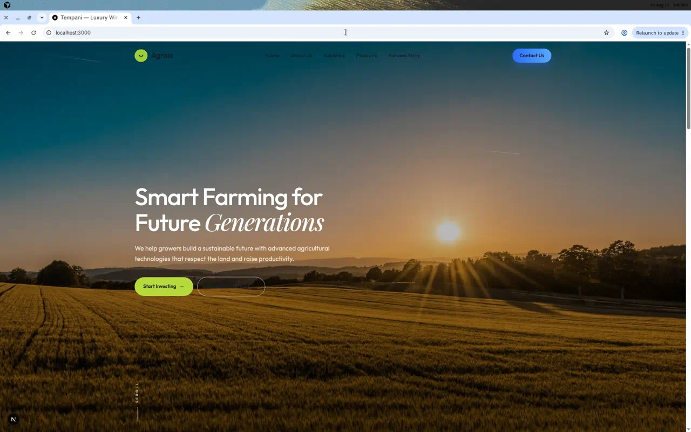
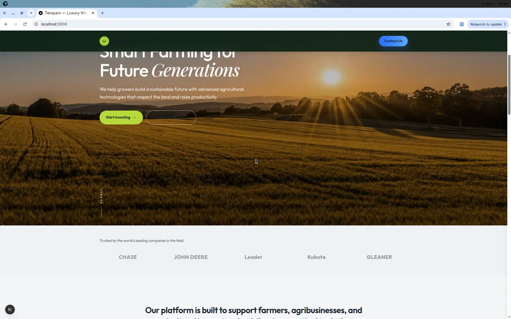
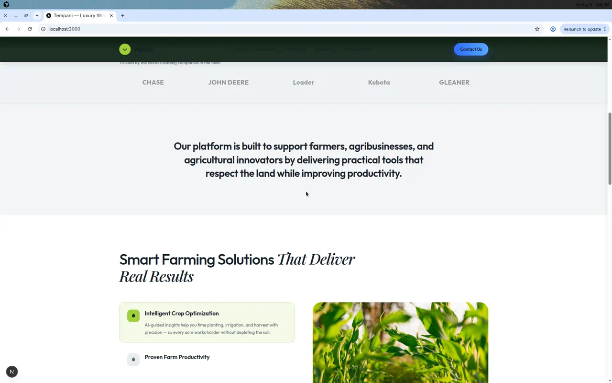
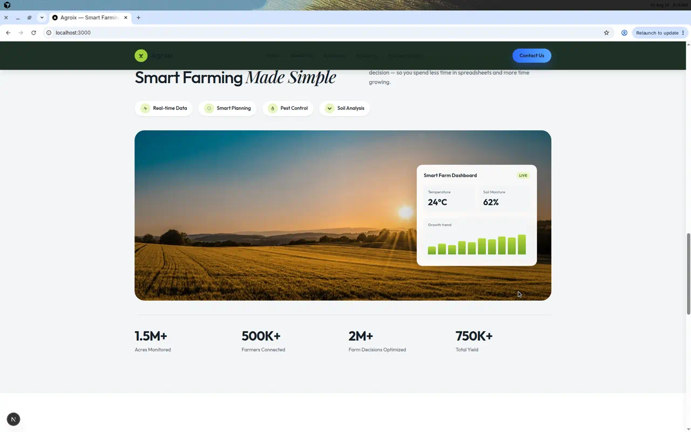
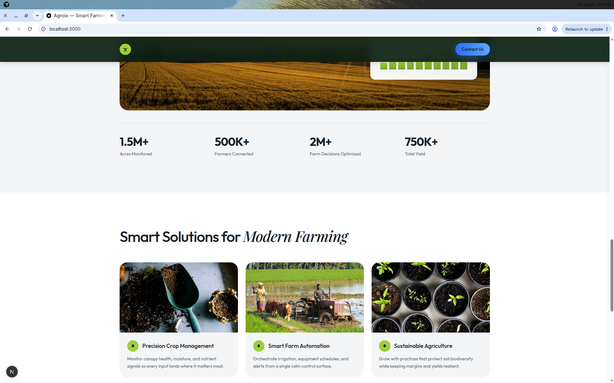
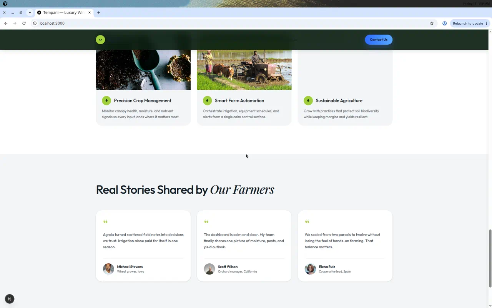

# Tempani

Production-ready e-commerce platform for **Tempani** — Medusa.js backend, Next.js WebFront, Mollie payments, and PostgreSQL.

## Architecture

```
apps/
  backend/      # Medusa v2 commerce API + Admin
  storefront/   # Next.js 15 luxury WebFront
packages/
  TempaniMedusaKit/  # Swift SPM SDK for Xcode / iOS product sync
```

| Layer | Technology |
| --- | --- |
| Commerce engine | Medusa.js 2.19 |
| Storefront | Next.js 15 (App Router) + TypeScript + Tailwind |
| iOS Admin SDK | Swift Package `TempaniMedusaKit` (Xcode) |
| Database | PostgreSQL (required by Medusa) |
| Payments | Mollie (`@variablevic/mollie-payments-medusa`) |
| Notifications | Local email provider (swap for Resend/SendGrid in prod) |

### Database note (Turso)

Medusa v2 **requires PostgreSQL**. The Turso/libSQL URL
`libsql://tempani-ericksonholding.aws-eu-west-1.turso.io` is stored in env as
`TURSO_DATABASE_URL` for optional non-Medusa services, but cannot host Medusa’s
commerce schema. Use `DATABASE_URL` for Postgres (local, Neon, Supabase, RDS, etc.).

## Prerequisites

- Node.js `^20.19.0` or `>=22.12.0`
- PostgreSQL 14+
- Redis (optional — in-memory fallback is used if unset)
- Mollie API key (optional for local manual payments)

## Quick start

```bash
# 1. Install
npm install

# 2. Backend env
cp apps/backend/.env.template apps/backend/.env
# Edit DATABASE_URL, JWT_SECRET, COOKIE_SECRET, MOLLIE_API_KEY

# 3. Storefront env
cp apps/storefront/.env.local.example apps/storefront/.env.local
# Set NEXT_PUBLIC_MEDUSA_PUBLISHABLE_KEY from Medusa Admin → Settings → Publishable API Keys

# 4. Database setup (first run)
cd apps/backend
npx medusa db:setup
# or, if DB already exists:
npx medusa db:migrate

# 5. Seed Tempani catalogue / enable Mollie on regions
npm run seed

# 6. Create an admin user
npx medusa user -e admin@tempani.com -p supersecret

# 7. Run (from repo root)
npm run backend:dev      # http://localhost:9000  (Admin: /app)
npm run storefront:dev   # http://localhost:3000
```

## Mollie

Set in `apps/backend/.env`:

```bash
MOLLIE_API_KEY=test_xxx
MOLLIE_REDIRECT_URL=http://localhost:3000/checkout/payment
MEDUSA_URL=http://localhost:9000
```

Supported provider IDs (enable per region in Admin → Settings → Regions):

| Method | Provider ID |
| --- | --- |
| Hosted Checkout | `pp_mollie-hosted-checkout_mollie` |
| iDEAL | `pp_mollie-ideal_mollie` |
| Card | `pp_mollie-card_mollie` |
| Bancontact | `pp_mollie-bancontact_mollie` |
| PayPal | `pp_mollie-paypal_mollie` |
| Apple Pay | `pp_mollie-apple-pay_mollie` |
| Gift Card | `pp_mollie-giftcard_mollie` |

Webhooks are handled by the Mollie provider at Medusa’s payment webhook endpoint.
After payment, customers return to `/checkout/payment`, which completes the cart.

Without `MOLLIE_API_KEY`, the backend starts with the system/manual payment provider so local checkout still works.

## Homepage (Agroix design)

The storefront home route (`/`) uses the Agroix smart-farming landing layout
(Outfit + Playfair Display, full-bleed hero, trusted-by strip, solutions accordion,
dashboard overlay, feature cards, farmer stories). Shop and account routes keep
the Tempani commerce chrome.

<video src="docs/demo/agroix-homepage-demo.mp4" controls width="720"></video>

[Download Agroix homepage demo](docs/demo/agroix-homepage-demo.mp4)

| Hero | Trusted by | Solutions |
| --- | --- | --- |
|  |  |  |

| Made Simple | Feature cards | Stories |
| --- | --- | --- |
|  |  |  |

## WebFront

Shop / product / cart / checkout keep the Tempani commerce journey:

Browse → Product → Cart → Checkout → Mollie → Confirmation → Account / Orders

Includes search, filters, sorting, wishlist, discounts, shipping options, SEO,
Open Graph, sitemap, robots.txt, and product JSON-LD.

## Environment variables

See:

- `apps/backend/.env.template`
- `apps/storefront/.env.local.example`

Never commit `.env` / `.env.local` files.

## iOS / Xcode SDK

Native Swift package for staff apps that create and update Medusa products:

```text
packages/TempaniMedusaKit
```

In Xcode: **File → Add Package Dependencies → Add Local…** → select that folder.
See `packages/TempaniMedusaKit/README.md` for login, upload, and product CRUD examples.

## Scripts

| Command | Description |
| --- | --- |
| `npm run backend:dev` | Start Medusa |
| `npm run storefront:dev` | Start WebFront |
| `npm run backend:seed` | Seed Tempani products / region payments |
| `npm run build` | Build all packages |

## License

MIT
